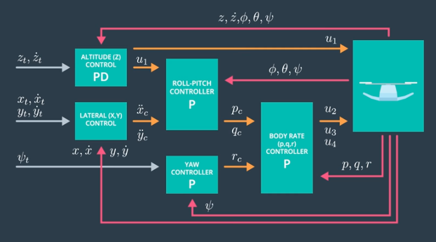
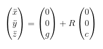
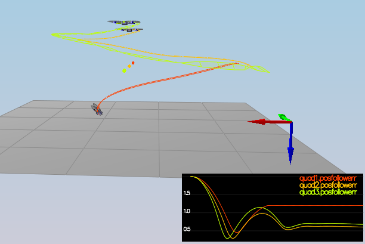
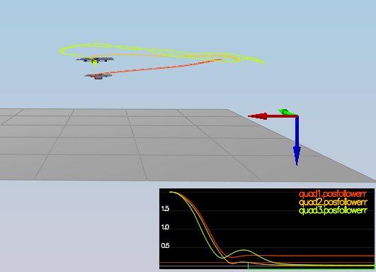
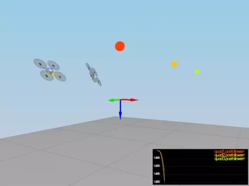

# 3D Quadrocopter Control



### Development environment

#### CMake on Linux

1. Create a new directory for the build files:

```sh
cd FCND-Controls-CPP
mkdir build
```

2. Navigate to the build directory and run `cmake` and then compile and build the code:

```sh
cd build
cmake ..
make
```

3. You should now be able to run the simulator with `./CPPSim` and you should see a single quadcopter,
falling down.

## Simulator Walkthrough

Now that you have all the code on your computer and the simulator running, let's walk through some of
the elements of the code and the simulator itself.

### The Code

For the project, the majority of your code will be written in `src/QuadControl.cpp`.  This file contains
all of the code for the controller that you will be developing.

All the configuration files for your controller and the vehicle are in the `config` directory.
For example, for all your control gains and other desired tuning parameters, there is a config file called
`QuadControlParams.txt` set up for you.  An import note is that while the simulator is running, you can edit this file
in real time and see the affects your changes have on the quad!

The syntax of the config files is as follows:

- `[Quad]` begins a parameter namespace.  Any variable written afterwards becomes `Quad.<variablename>`
  in the source code.
- If not in a namespace, you can also write `Quad.<variablename>` directly.
- `[Quad1 : Quad]` means that the `Quad1` namespace is created with a copy of all the variables of `Quad`.
  You can then overwrite those variables by specifying new values (e.g. `Quad1.Mass` to override the copied `Quad.Mass`).
  This is convenient for having default values.

You will also be using the simulator to fly some difference trajectories to test out the performance of your C++
implementation of your controller. These trajectories, along with supporting code, are found in the `traj`
directory of the repo.

### The Simulator

In the simulator window itself, you can right click the window to select between a set of different
scenarios that are designed to test the different parts of your controller.

The simulation (including visualization) is implemented in a single thread.  This is so that you can
safely breakpoint code at any point and debug, without affecting any part of the simulation.

Due to deterministic timing and careful control over how the pseudo-random number generators are
initialized and used, the simulation should be exactly repeatable. This means that any simulation with the same
configuration should be exactly identical when run repeatedly or on different machines.

Vehicles are created and graphs are reset whenever a scenario is loaded. When a scenario is reset (due
to an end condition such as time or user pressing the ‘R’ key), the config files are all re-read and
state of the simulation/vehicles/graphs is reset -- however the number/name of vehicles and displayed
graphs are left untouched.

When the simulation is running, you can use the arrow keys on your keyboard to impact forces on your
drone to see how your controller reacts to outside forces being applied.

#### Keyboard / Mouse Controls

There are a handful of keyboard / mouse commands to help with the simulator itself, including applying
external forces on your drone to see how your controllers reacts!

- Left drag - rotate
- X + left drag - pan
- Z + left drag - zoom
- arrow keys, W and S - apply external force
- C - clear all graphs
- R - reset simulation
- Space - pause simulation

### Testing it Out

When you run the simulator (or start scenario `1_Intro`), the quad is
falling straight down. This is due to the fact that the thrusts are simply
being set to:

```
QuadControlParams.Mass * 9.81 / 4
```

Therefore, if the mass doesn't match the actual mass of the quad,
it'll fall down.  Take a moment to tune the `Mass` parameter in `QuadControlParams.txt`
to make the vehicle more or less stay in the same spot.

With the proper mass, your simulation looks a little like this:


## The Tasks

For this project, you will be building a controller in C++.  You will be implementing and
tuning this controller in several steps.

You may find it helpful to consult the 
[Python controller code](misc/controller.py) ([source](https://github.com/udacity/FCND-Controls/blob/solution/controller.py)
as a reference when you build out this controller in C++.

#### Notes on Parameter Tuning

1. **Comparison to Python**: Note that the vehicle you'll be controlling in this portion of
   the project has different parameters than the vehicle that's controlled by the Python code linked
   to above. **The tuning parameters that work for the Python controller will not work for
   this controller**
2. **Parameter Ranges**: You can find the vehicle's control parameters in a file called
   `QuadControlParams.txt`. The default values for these parameters are all too small by a factor
   of somewhere between about 2X and 4X. So if a parameter has a starting value of 12, it will
   likely have a value somewhere between 24 and 48 once it's properly tuned.
3. **Parameter Ratios**: In this [one-page document](papers/double-integrator-control-gain/paper.pdf)
   ([source](https://www.overleaf.com/read/bgrkghpggnyc#/61023787/))
   you can find a derivation of the ratio of velocity proportional gain to position proportional
   gain for a critically damped double integrator system. The ratio of `kpV / kpP` should be 4.

Dronecode provides some guidelines on PID tuning at

- [Advanced Multicopter Position Control Tuning](https://docs.px4.io/v1.9.0/en/config_mc/advanced_mc_position_tuning.html) and
- [Multicopter PID Tuning Guide](https://docs.px4.io/v1.9.0/en/config_mc/pid_tuning_guide_multicopter.html)

### Body rate and roll/pitch control (scenario 2)

First, body rate and roll/pitch control was implemented; for this, `Scenario 2` of the simulation was used.
In this scenario, the quad is created above the origin using a small initial rotation speed about its
roll axis.

1. Body rate control

First, the controller needs to stabilize the rotational motion and bring the vehicle back to level attitude.
For this, the `GenerateMotorCommands()` and `BodyRateControl()` methods were implemented first;
the `kpPQR` controller gain was tuned accordingly to stabilize the rotational motion.

As a result, the roll rotation around the drone's x axis (`omega.x`) is controlled to 0 in
about 0.065 seconds. Since the roll angle itself is not controlled yet, the drone will still
stay at an angle and thus will slightly fly sideways. The controller does overshoot about 10 degrees
due to motor dynamics.

- `kpPQR` = 100, 100, 5

2. Roll / pitch control

Ignoring yaw control for now, the `RollPitchControl` method was implemented and the bank controller
gain `kpBank` was tuned accordingly by iteratively attempting to get a fast set time, then backing
off to reduce overshoot. After doing so, the drone's roll angle gets corrected close to 0
in about 0.065 seconds; however, the body rate controller now takes slightly longer (0.070 seconds)
to control the roll rate to 0.

- `kpPQR` = 78, 78, 5
- `kpBank` = 3

As a result, the drone's reaction did resemble a path somewhat like this:


... except that the drone actually drops to the ground.

Note that the animation was provided by the starter code and does not resemble the actual results.
However, since the GIFs are already in the repo and quite heavy in size, I didn't bother creating
a new animation that would bloat the repo up even more. For the time being, just take my word for it. 😁

### Position/velocity and yaw angle control (scenario 3)

Next, the altitude, position and yaw control was implemented. This corresponds to `Scenario 3`
in the simulation. In there, two identical quads are created at some offset from their target
points. In addition, one of the drones is initialized with a yaw of 45 degrees. 

One of the implications here is that we need to convert information in global frame (such as the
altitude) into thrust in the body frame. The following rotation relation came in handy:



- The `AltitudeControl()` method was implemented first using a PD control
  scheme (with feedforward).
- The `LateralPositionControl()` method was implemented next, again
  using a PD control scheme (with feedforward).

The controller parameters had to be re-adjusted and now are

- `kpPQR` = 85, 85, 5
- `kpBank` = 20
- `kpVelXY` = 9.3
- `kpPosXY` = 50

In this configuration, the goal position is reached after 0.360 seconds. Without
yaw control, one of the two drones does have a bad attitude.

To mitigate, yaw control was added next (`YawControl()`) and the according controller
gains set to

- `kpYaw` = 3
- `kpPQR` = 85, 85, 10

The drones now both reach their goals and have zero yaw.
The following note of the original `README.md` is kept here for future reference:

> Tune position control for settling time. Don’t try to tune yaw control too tightly,
> as yaw control requires a lot of control authority from a quadcopter and can really
> affect other degrees of freedom. This is why you often see quadcopters with tilted
> motors: better yaw authority!

Another one regarding the controller gain magnitudes: 

> **Hint:**  For a second order system, such as the one for this quadcopter,
> the velocity gain (`kpVelXY` and `kpVelZ`) should be at least ~3-4 times greater
> than the respective position gain (`kpPosXY` and `kpPosZ`).

Interestingly, setting the velocity gain higher than the position gain led
to chaos for me.


### Non-idealities and robustness (scenario 4)

In `Scenario 4` we can explore some of the non-idealities and properties issues of a controller.
This is a configuration with 3 quads that are all are trying to move one meter forward.
However, this time, these quads are all a bit different:

- The green quad has its center of mass shifted back
- The orange vehicle is an ideal quad
- The red vehicle is heavier than usual.

When running the controllers in the configuration from the previous scenario,
not everything works as expected (as, funnily enough, can be expected).
While the red drone immediately decides to say hi to the floor, both the orange
and green drones fly to about one meter above the reference point.



The original `README.md` stated

> tip: relax the controller

and after tuning the controller gains once more to

- `kpPosXY` = 30 (from 50)
- `kpPosZ` = 20 (from 1)
- `kpVelXY` = 9 (from 9.3)
- `kpVelZ` = 9 (from 4)

all but the red drone reached the goal position. The green drone overshoots,
but quickly corrects its mistake.



Since the red drone has a higher mass than anticipated, the altitude controller
exhibits a systematic bias that cannot be governed by the proportional part
(nor by the differential part, for that matter).

Adding an integrator term to build a feed-forward PID controller for the attitude
solved this problem, but not before changing the controller once more:

- `kpPosXY` = 29 (from 30)
- `kpPosZ` = 40 (from 20)
- `KiPosZ` = 40 (from 20)



### Tracking trajectories

Now that we have all the working parts of a controller, you will put it all together and test it's
performance once again on a trajectory.  For this simulation, you will use `Scenario 5`.
This scenario has two quadcopters:
 
 - the orange one is following `traj/FigureEight.txt`
 - the other one is following `traj/FigureEightFF.txt` - for now this is the same trajectory.
 
For those interested in seeing how you might be able to improve the performance of your drone by
adjusting how the trajectory is defined, check out **Extra Challenge 1** below!

How well is your drone able to follow the trajectory?  It is able to hold to the path fairly well?


### Extra Challenge 1 (Optional)

You will notice that initially these two trajectories are the same. Let's work on improving some
performance of the trajectory itself.

1. Inspect the python script `traj/MakePeriodicTrajectory.py`.  Can you figure out a way to generate
a trajectory that has velocity (not just position) information?

2. Generate a new `FigureEightFF.txt` that has velocity terms
Did the velocity-specified trajectory make a difference? Why?

With the two different trajectories, your drones' motions should look like this:


### Extra Challenge 2 (Optional)

For flying a trajectory, is there a way to provide even more information for even better tracking?

How about trying to fly this trajectory as quickly as possible (but within following threshold)!


## Evaluation

To assist with tuning of your controller, the simulator contains real time performance evaluation.
We have defined a set of performance metrics for each of the scenarios that your controllers must meet
for a successful submission.

There are two ways to view the output of the evaluation:

 - in the command line, at the end of each simulation loop, a **PASS** or a **FAIL** for each metric being evaluated in that simulation
 - on the plots, once your quad meets the metrics, you will see a green box appear on the plot notifying you of a **PASS**

### Performance Metrics

The specific performance metrics are as follows:

 - scenario 2
   - roll should less than 0.025 radian of nominal for 0.75 seconds (3/4 of the duration of the loop)
   - roll rate should less than 2.5 radian/sec for 0.75 seconds

 - scenario 3
   - X position of both drones should be within 0.1 meters of the target for at least 1.25 seconds
   - Quad2 yaw should be within 0.1 of the target for at least 1 second


 - scenario 4
   - position error for all 3 quads should be less than 0.1 meters for at least 1.5 seconds

 - scenario 5
   - position error of the quad should be less than 0.25 meters for at least 3 seconds

## Authors

Thanks to Fotokite for the initial development of the project code and simulator.
